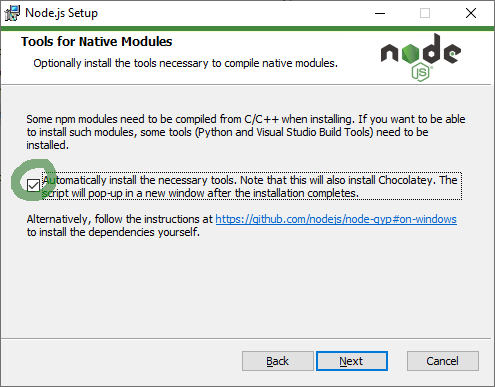

Chaturbate E-stim 2B controller
=========

An application to control the E-Stim systems 2B based on tips
Copy settings.json.example to settings.json
Adjust the settings to your preferences.
If settings are updated when the application is running it will take 10 seconds to apply them.

## Known Issues / unimplemented features

Changing C or D settings is not implemented

## Getting started
* Use the clone / download button to download the zip file of this repository
* Unpack the zip file in a new folder.

## Setup Linux
* Have Google Chrome >= version 59 installed
* Have NodeJS installed
* Have Python installed
Run in folder of chaturbate e-stim controller:
```shell
npm install
pip install pyserial
```

## Setup Windows
* Have Google Chrome >= version 59 installed
* Download Windows msi installer for NodeJS form https://nodejs.org/en/download/
* Run the installer, make sure you select the following options;
  * Use default options
  * Make sure "Automatic install necessary tools." is selected.
  * After clicking finish a command-line window will pop up. Press any letter key two times to continue.

* Reboot
* Start "node js command prompt"
Run in folder of chaturbate e-stim controller:
```shell
npm install
pip install pyserial
```

## Usage

```shell
node index.js <USERNAME HERE>
# or
yarn start <USERNAME HERE>
# or
npm start <USERNAME HERE>
```

