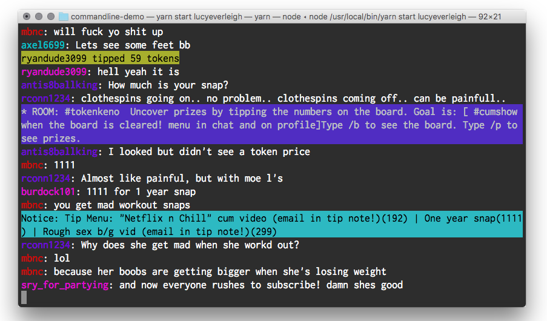

Chaturbate Commandline Demo
=========

A demo for displaying Chaturbate events in a terminal.



## Setup (non-docker)
* Have Google Chrome >= version 59 installed
* Have NodeJS installed
```shell
npm install -G yarn
yarn install
```

## Usage

```shell
node index.js <USERNAME HERE>
# or
yarn start <USERNAME HERE>
# or
npm start <USERNAME HERE>
```

## Debug Usage

```shell
DEBUG=chaturbate:* node index.js <USERNAME HERE>
# or
DEBUG=chaturbate:* yarn start <USERNAME HERE>
# or
DEBUG=chaturbate:* npm start <USERNAME HERE>
```

## Docker Usage

##### Helper Script
```shell
sh start-docker.sh <USERNAME HERE>
```

##### Manually

```shell
docker rm -f cb-app

docker build -t cb/app .

docker run \
  -ti \
  --name=cb-app \
  -e CB_USERNAME="<USERNAME HERE>" \
  --cap-add=SYS_ADMIN \
  cb/app
```